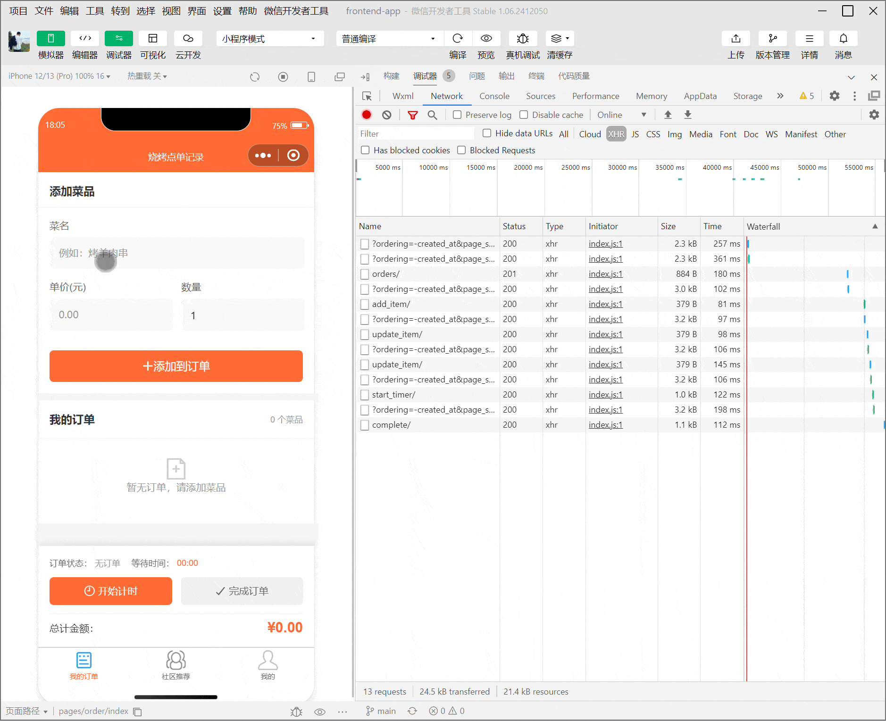
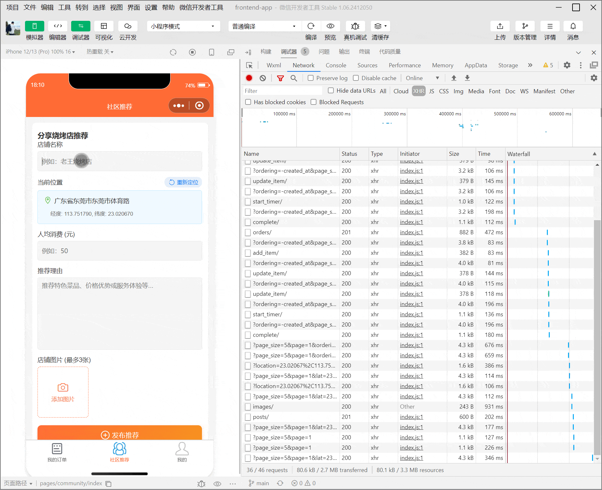

# MiaoBBQ - BBQ Ordering & Community Recommendation Full-Stack Project

[中文文档](README.md) | **English**

A WeChat Mini Program developed with Taro + Django, providing BBQ ordering records and community recommendation sharing features.

## 📱 Feature Demo

<div align="center">
  
  <br>
  <em>Order Recording Feature Demo</em>
  <br><br>
  
  <br>
  <em>Community Recommendation Feature Demo</em>
</div>

## 🍖 Core Features

### 📝 Ordering Record Function
- Record BBQ order details (dish name, unit price, quantity)
- Real-time calculation of total order amount
- Meal waiting timer function, record dining time
- Order status management (pending/in progress/completed)
- Local storage of order history
- Form validation and error prompts

### 🌍 Community Recommendation Function  
- Publish BBQ restaurant recommendation shares
- Upload restaurant images (up to 3 photos)
- Location-based nearby restaurant recommendations
- Multiple sorting methods (nearest distance, latest posts, most popular)
- Restaurant likes and view statistics
- Recommendation content search and filtering

### 📍 Geolocation Service
- Smart location permission request
- GPS positioning and address resolution
- Location-based nearby restaurant queries
- Distance calculation and display
- Graceful degradation when location permission is denied

### 🛠 Admin Backend Function
- Administrator login authentication
- Content moderation workflow
- User data statistics
- Operation log recording
- Dashboard data display

## 🛠 Tech Stack

### Frontend Technology
- **Mini Program**: Taro 4.1.5 + React 18 + TypeScript + Sass
- **Admin Panel**: Vite + React 19 + TypeScript + Sass
- **UI Components**: Taro UI 3.3.0
- **State Management**: Zustand
- **Package Manager**: pnpm

### Backend Technology  
- **Framework**: Django 5.2.4 + Django REST Framework
- **Database**: SQLite (development) / MySQL (production)
- **Authentication**: Based on WeChat Mini Program openid
- **CORS**: django-cors-headers

## 🚀 Quick Start

### Environment Requirements
- Node.js >= 16
- Python 3.10+
- pnpm
- WeChat Developer Tools

### Backend Setup

1. **Activate virtual environment and install dependencies**
   ```bash
   # Windows Git Bash
   source ./backend/venv/Scripts/activate
   pip install -r ./backend/requirements.txt
   ```

2. **Initialize database**
   ```bash
   python ./backend/manage.py migrate
   ```

3. **Start backend service**
   ```bash
   python ./backend/manage.py runserver
   ```

### Mini Program Setup

1. **Install dependencies**
   ```bash
   cd frontend-app
   pnpm install
   ```

2. **Start development service**
   ```bash
   pnpm run dev:weapp
   ```

3. **Import to WeChat Developer Tools**
   - Open WeChat Developer Tools
   - Import project directory: `frontend-app/dist`
   - Configure Mini Program AppID

### Admin Panel Setup

```bash
cd frontend-admin
pnpm install
pnpm run dev
```
